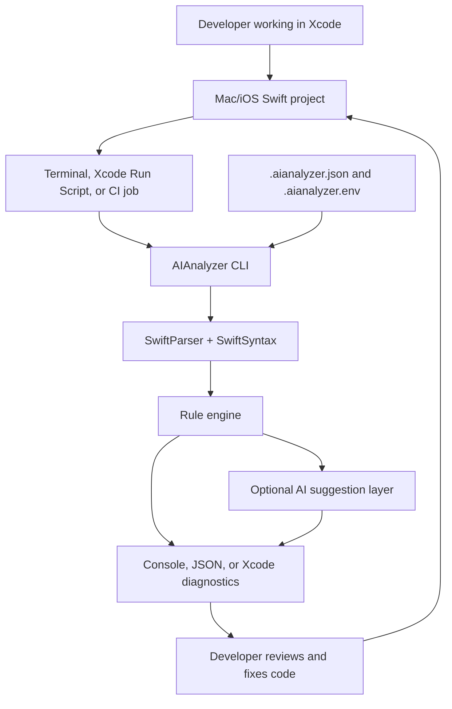
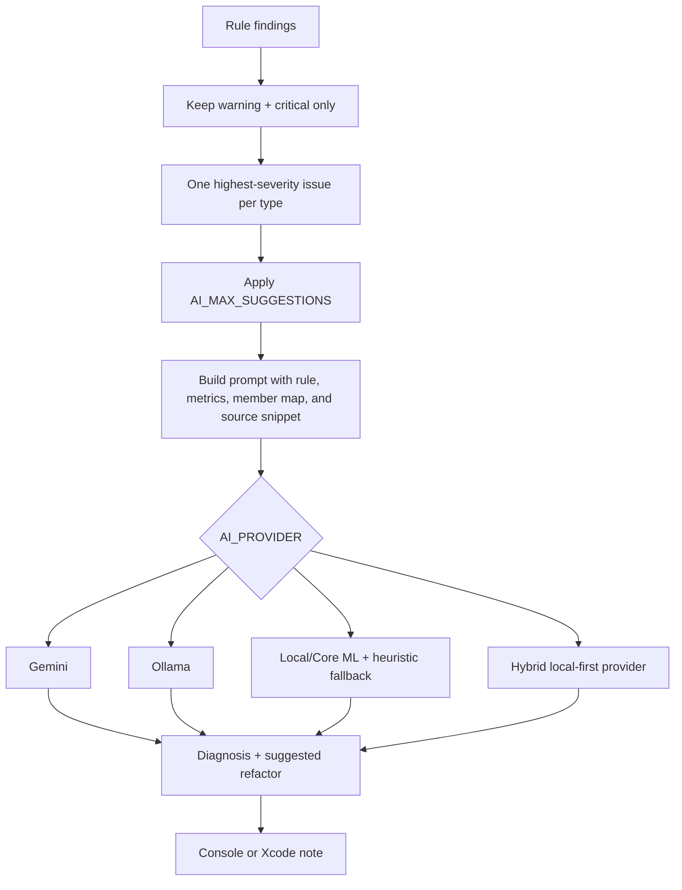

# AIAnalyzer

AIAnalyzer is a Swift command-line tool that scans Swift source code, finds common architecture and maintainability problems, and can optionally ask an AI provider for refactoring suggestions.

Think of it as a lightweight static-analysis assistant for Mac and iOS projects. New developers can run it locally, wire it into Xcode, or use the JSON output in scripts and CI.

---

## Quick Start

Run these commands from this repository:

```bash
swift build
swift test
AI_ENABLED=false swift run AIAnalyzer sample.swift
```

Scan another Swift project:

```bash
AI_ENABLED=false swift run AIAnalyzer /path/to/YourMacProject
```

Emit Xcode-compatible diagnostics:

```bash
AI_ENABLED=false swift run AIAnalyzer /path/to/YourMacProject --xcode
```

Emit machine-readable JSON:

```bash
AI_ENABLED=false swift run AIAnalyzer /path/to/YourMacProject --json
```

---

## Technology Stack

| Area | Technology | How it is used |
| --- | --- | --- |
| Language | Swift 5.7+ | Main implementation language. |
| Package manager | Swift Package Manager | Builds the executable and test target. |
| Platforms | macOS 13+, iOS 13+ package platforms | The analyzer runs as a command-line executable, primarily on macOS. |
| Parser | SwiftParser | Parses Swift source into a syntax tree. |
| Syntax tree API | SwiftSyntax | Visits declarations and extracts structure from Swift files. |
| Testing | XCTest through `swift test` | Unit tests cover rules, visitor behavior, AI orchestration, and input validation. |
| Reporting | Console, JSON, Xcode diagnostics | Outputs findings for humans, automation, and Xcode integration. |
| AI providers | Gemini, Ollama, local/Core ML, hybrid | Optional suggestions for warning and critical issues. |
| Configuration | `.aianalyzer.json`, `.aianalyzer.env`, environment variables | Controls ignored folders, rule toggles, thresholds, and AI runtime settings. |

Primary dependency from `Package.swift`:

```swift
.package(url: "https://github.com/apple/swift-syntax.git", from: "508.0.0")
```

---

## How It Fits Into a Mac Project

Use AIAnalyzer beside your normal Mac or iOS project. Xcode remains your editor, build system, preview tool, and debugger. AIAnalyzer acts as a project health check that can be run from Terminal, an Xcode Run Script phase, a CI job, or a local developer script.



Recommended local workflow:

1. Add a project-level `.aianalyzer.json` when you need custom ignores or thresholds.
2. Run the analyzer before large refactors or before opening a pull request.
3. Use `--xcode` when you want findings to appear as Xcode warnings/errors.
4. Use `--json` when another tool or CI job needs to consume the results.
5. Turn AI on only when you want explanation and refactoring help, not for deterministic test runs.

---

## What The App Checks

AIAnalyzer parses each Swift file and extracts metrics for classes, structs, enums, actors, and extensions. It then runs a set of independent rules.

| Rule | What it checks | Severity |
| --- | --- | --- |
| `LargeClassRule` | Types with too many methods or too many lines. Uses different limits for ViewControllers, ViewModels, services, models, and unknown types. | Warning or critical |
| `HighMethodDensityRule` | Types with too many methods packed into a relatively small type. Skips very large files so `LargeClassRule` can own that signal. | Warning or critical |
| `GodObjectRule` | Types that breach at least two major signals, such as methods, properties, and lines. | Critical |
| `DataHeavyClassRule` | Types with too many stored properties. | Info |
| `ViewModelUIKitRule` | ViewModel-like types whose file imports `UIKit` or `UIKit.*`. | Critical |
| `ModelServiceUIKitRule` | Model-like or service-like types whose file imports `UIKit` or `UIKit.*`. | Critical |

Type classification is name-based:

| Name contains | Classified as |
| --- | --- |
| `viewcontroller` | ViewController |
| `viewmodel` | ViewModel |
| `service` or `manager` | Service |
| `model` | Model |
| Anything else | Unknown |

This is intentionally simple. The analyzer does not currently do full type resolution, module graph analysis, or folder-based architecture inference.

---

## End-To-End Pipeline

```mermaid
flowchart LR
    Input["Input path"]
    Validate["Validate file or folder"]
    Env["Load .aianalyzer.env"]
    Config["Load .aianalyzer.json"]
    Scan["Discover .swift files"]
    Parse["Parse with SwiftParser"]
    Visit["Visit with ClassVisitor"]
    Analyze["Run RuleEngine"]
    Report["Report output"]
    AISuggest["Optional AISuggester"]

    Input --> Validate
    Validate --> Env
    Env --> Config
    Config --> Scan
    Scan --> Parse
    Parse --> Visit
    Visit --> Analyze
    Analyze --> Report
    Analyze --> AISuggest
    AISuggest --> Report
```



Detailed sequence:

1. The CLI reads `--json`, `--xcode`, and one optional input path.
2. The input path is validated. A single file must be a `.swift` file.
3. `.aianalyzer.env` is loaded from the config root when present.
4. `.aianalyzer.json` is loaded and merged with default settings.
5. Directory scans recursively collect `.swift` files while skipping ignored folders.
6. `SwiftParser` parses each source file.
7. `ClassVisitor` collects type metrics, member counts, line estimates, and imports.
8. `RuleEngine` evaluates each rule and suppresses some duplicate noise when `GodObjectRule` already fired.
9. The app prints console output, JSON, or Xcode-compatible diagnostics.
10. If AI is enabled and configured, warning and critical findings are enriched with suggestions.

---

## Output Modes

### Console Output

Default mode is meant for humans.

```bash
AI_ENABLED=false swift run AIAnalyzer /path/to/YourMacProject
```

It prints:

- File name.
- Type names and inferred type categories.
- Method, property, initializer, accessor, subscript, and line counts.
- Approximate member map.
- Issues found in each file.
- Top files with issues.
- Final summary totals.

### JSON Output

Use JSON when another tool needs to consume the result.

```bash
AI_ENABLED=false swift run AIAnalyzer /path/to/YourMacProject --json
```

Each issue is emitted as an `IssueReport`:

```json
{
  "file": "UserViewModel.swift",
  "line": null,
  "message": "UserViewModel imports UIKit. ViewModels should not depend on UIKit.",
  "rule": "ViewModelUIKitViolation",
  "severity": "🔴 Critical",
  "typeName": "UserViewModel"
}
```

Important behavior:

- JSON mode disables AI suggestions.
- JSON mode keeps stdout machine-readable.
- File read errors are written to stderr.
- Add `--fail-on-critical`, `--fail-on-warning`, or `--strict` when JSON is used as a CI quality gate.

### Xcode Output

Use Xcode mode when running the analyzer from a Run Script phase or a local script opened from Xcode.

```bash
AI_ENABLED=false swift run AIAnalyzer /path/to/YourMacProject --xcode
```

The output uses this shape:

```text
/path/to/File.swift:1: warning: [AIAnalyzer] message
/path/to/File.swift:1: error: [AIAnalyzer] critical message
note: [AIAnalyzer] Analysis complete. Found 3 issues in 12 files.
```

Xcode can display these as warnings, errors, and notes in the issue navigator.

### CI Exit Gates

By default, AIAnalyzer exits successfully when the scan completes, even if it finds issues. Team scripts and CI jobs can opt into failing behavior:

| Flag | Exit behavior |
| --- | --- |
| `--fail-on-critical` | Exit `1` when at least one critical issue is found. |
| `--fail-on-warning` | Exit `1` when at least one warning or critical issue is found. |
| `--strict` | Exit `1` when any issue is found, including info-level findings. |

Examples:

```bash
AI_ENABLED=false swift run AIAnalyzer /path/to/YourMacProject --json --fail-on-critical
AI_ENABLED=false swift run AIAnalyzer /path/to/YourMacProject --xcode --fail-on-warning
AI_ENABLED=false swift run AIAnalyzer /path/to/YourMacProject --strict
```

---

## How AI Assistance Works

AI is optional. Static analysis always runs first. The AI layer only receives warning and critical findings, so informational issues do not generate AI requests.



AI can help developers understand:

- Why the rule fired.
- What architectural boundary was crossed.
- Which refactor is likely to reduce risk.
- A quick first step before doing a larger cleanup.

AI should be treated as guidance. The rule output is deterministic; the AI explanation is advisory and should be reviewed by a developer.

### Enable AI

Gemini:

```bash
AI_ENABLED=true \
AI_PROVIDER=gemini \
GEMINI_API_KEY=your_key_here \
swift run AIAnalyzer /path/to/YourMacProject
```

Ollama:

```bash
AI_ENABLED=true \
AI_PROVIDER=ollama \
OLLAMA_MODEL=qwen2.5-coder:7b \
OLLAMA_ENDPOINT=http://localhost:11434 \
swift run AIAnalyzer /path/to/YourMacProject
```

Hybrid local-first mode:

```bash
AI_ENABLED=true \
AI_PROVIDER=hybrid \
OLLAMA_MODEL=qwen2.5-coder:7b \
GEMINI_API_KEY=your_key_here \
swift run AIAnalyzer /path/to/YourMacProject
```

### AI Environment Variables

| Variable | Purpose |
| --- | --- |
| `AI_ENABLED` | Must be `true` to enable AI suggestions. |
| `AI_PROVIDER` | `gemini`, `ollama`, `local`, or `hybrid`. Defaults to `gemini`. |
| `GEMINI_API_KEY` | Required for Gemini. Used by hybrid for cloud escalation. |
| `AI_MODEL` | Gemini model name. Defaults to `gemini-1.5-flash`. |
| `OLLAMA_MODEL` | Ollama model name. Defaults to `qwen2.5-coder:7b`. |
| `OLLAMA_ENDPOINT` | Ollama endpoint. Host-only values are normalized to `/v1/chat/completions`. |
| `AI_LOCAL_MODEL` | Display name for the local model. |
| `AI_LOCAL_MODEL_PATH` | Optional path to a local Core ML model artifact. |
| `AI_MAX_SUGGESTIONS` | Maximum AI suggestions per analyzed file. Defaults to `5`. |
| `AI_SNIPPET_LINES` | Number of source lines included in each AI prompt. Defaults to `120`. |
| `AI_VERBOSE` | Prints more raw AI output when `true`. |
| `AI_TYPEWRITER_MS` | Console typewriter delay for AI output. |

---

## Configuration Cookbook

Create `.aianalyzer.json` in the root of the project you want to scan.

### Ignore Generated Or Third-Party Code

```json
{
  "ignoreDirectories": [
    "Generated",
    "Vendor",
    "TestFixtures"
  ]
}
```

These values are unioned with the defaults:

```text
.build, .git, .swiftpm, DerivedData, Pods, Build, Carthage
```

### Tune Rule Thresholds

```json
{
  "rules": {
    "largeClass": {
      "enabled": true,
      "threshold": 18
    },
    "highMethodDensity": {
      "enabled": true,
      "threshold": 12
    },
    "dataHeavyClass": {
      "enabled": true,
      "threshold": 8
    }
  }
}
```

### Disable A Rule

```json
{
  "rules": {
    "modelServiceUIKit": {
      "enabled": false
    }
  }
}
```

Available rule keys:

- `largeClass`
- `highMethodDensity`
- `godObject`
- `dataHeavyClass`
- `viewModelUIKit`
- `modelServiceUIKit`

### Store AI Settings In `.aianalyzer.env`

```bash
AI_ENABLED=true
AI_PROVIDER=ollama
OLLAMA_MODEL=qwen2.5-coder:7b
OLLAMA_ENDPOINT=http://localhost:11434
AI_MAX_SUGGESTIONS=3
AI_SNIPPET_LINES=120
```

For deterministic local tests and CI, prefer:

```bash
AI_ENABLED=false
```

### Suppress A Known Finding

Use a source comment when a rule is intentionally noisy for a specific file. Suppressions are file-level and apply before reporting, summaries, CI gates, and AI suggestions.

Disable one rule for the file:

```swift
// aianalyzer:disable LargeClass
```

Disable multiple rules:

```swift
// aianalyzer:disable LargeClass, GodObject
```

Disable every analyzer finding for the file:

```swift
// aianalyzer:disable all
```

Prefer narrow rule suppressions over `all`, and add a normal code comment explaining why the exception is intentional.

---

## Developer Cookbook

### Run The Full Test Suite

```bash
swift test
```

### Run One Test Area

```bash
swift test --filter ModelServiceUIKitRuleTests
swift test --filter Visitor
swift test --filter AISuggesterTests
```

### Smoke Test The CLI

```bash
AI_ENABLED=false swift run AIAnalyzer Fixtures/SmokeSample.swift --json
```

### Analyze The Included Sandbox

```bash
AI_ENABLED=false swift run AIAnalyzer TestSandbox/MessyProject
```

### Analyze A Real Mac App

```bash
AI_ENABLED=false swift run AIAnalyzer /Users/you/Projects/MyMacApp
```

### Use As A Pull Request Gate

Start with critical-only gating so the analyzer can be introduced without blocking teams on every advisory finding:

```bash
AI_ENABLED=false swift run AIAnalyzer /Users/you/Projects/MyMacApp --json --fail-on-critical
```

As the project adopts the rules, tighten the gate:

```bash
AI_ENABLED=false swift run AIAnalyzer /Users/you/Projects/MyMacApp --json --fail-on-warning
```

Use strict mode only when the project has a clean baseline:

```bash
AI_ENABLED=false swift run AIAnalyzer /Users/you/Projects/MyMacApp --json --strict
```

### Add A New Rule

1. Add a new type under `Sources/AIAnalyzer/Rules/` that conforms to `Rule`.
2. Add default configuration in `AnalyzerConfig+Default.swift` if it should be configurable.
3. Add a property to `AnalyzerConfig.RuleConfig` if it needs a JSON toggle.
4. Merge the user config in `ConfigLoader`.
5. Register the rule in `AnalyzerApp.main()`.
6. Add focused tests under `Tests/AIAnalyzerTests/`.
7. Decide the severity carefully. Only warning and critical issues are eligible for AI suggestions.

### Add A New AI Provider

1. Create a type under `Sources/AIAnalyzer/AI/` that conforms to `AIProvider`.
2. Add provider configuration to `AIConstants` and `AIConfiguration` if needed.
3. Wire provider construction in `AnalyzerApp.buildAISuggester`.
4. Add unit tests using test doubles from `Tests/AIAnalyzerTests/TestAIProviderStubs.swift`.

### Add A New Output Format

1. Add a reporter under `Sources/AIAnalyzer/Reporting/`.
2. Conform to `Reporter`.
3. Add a CLI flag in `AnalyzerApp.parseCLIArguments()`.
4. Select the reporter in `AnalyzerApp.main()`.
5. Add tests for formatting if the output is machine-consumed.

---

## Source Map

| Folder | Purpose |
| --- | --- |
| `Sources/AIAnalyzer/App` | CLI entry point, input validation, environment loading, provider wiring. |
| `Sources/AIAnalyzer/AI` | AI provider protocols, Gemini/Ollama/local/hybrid providers, prompt and formatter logic. |
| `Sources/AIAnalyzer/Extension` | Default analyzer configuration. |
| `Sources/AIAnalyzer/Models` | Shared models such as `ClassInfo`, `Issue`, `AnalyzerConfig`, and summaries. |
| `Sources/AIAnalyzer/Reporting` | Console and Xcode reporters. |
| `Sources/AIAnalyzer/Rules` | Static analysis rules and rule engine. |
| `Sources/AIAnalyzer/Utils` | File scanning and JSON config loading. |
| `Sources/AIAnalyzer/Visitor` | SwiftSyntax visitor that extracts type metrics. |
| `Tests/AIAnalyzerTests` | Unit tests by concern. |
| `Fixtures` | Small smoke-test fixture. |
| `TestSandbox` | Sample projects for manual analyzer runs. |

---

## Current Limitations

- Type classification is based on type names, not semantic type resolution.
- Import checks use file-level imports, so every type in the same file sees the same import list.
- Member line ranges are approximate and based on syntax descriptions, not precise source locations.
- JSON mode does not include AI suggestions.
- AI output is advisory and can vary by provider/model.

---

## Related Docs

- `TESTING.md` covers test commands and visitor-focused troubleshooting.
- `Project Roadmap.rtf` contains planning notes.

---

## Ownership

Project by Johnson Elangbam. Dependencies are governed by their own licenses.
