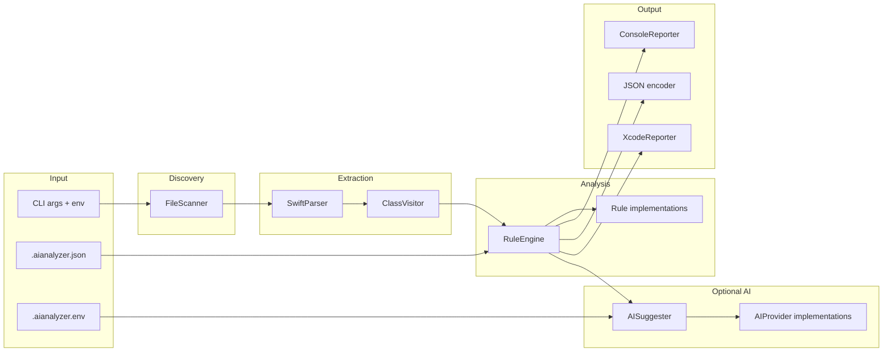

# AIAnalyzer — Project Handbook

AIAnalyzer is a **macOS command-line static analyzer for Swift**. It parses Swift source with **SwiftSyntax**, extracts structural metrics per type (class, struct, enum, actor, extension), runs a **pluggable rule engine**, optionally enriches **warning** and **critical** findings with **LLM-backed refactoring suggestions**, and prints results for humans (console), machines (`--json`), or Xcode (`--xcode`).

This document is the authoritative reference for architecture, data flow, configuration, and the AI layer.

---

## Recent updates (read this first)

This section describes **material changes** to the codebase and how they affect you as a reader, contributor, or integrator. Earlier sections of the handbook remain the deep reference; here the focus is on **what is new** and **where to look**.

### 1. Model / Service UIKit layering rule (`ModelServiceUIKitRule`)

A new architectural rule enforces **separation between UI frameworks and non-UI layers** for types the analyzer classifies as **models** or **services** (using the same **name-based heuristics** as `ClassVisitor`, not full type-resolution).

| Aspect | Detail |
|--------|--------|
| **Source file** | `Sources/AIAnalyzer/Rules/ModelServiceUIKitRule.swift` |
| **Rule identifier (`Issue.ruleName`)** | `ModelServiceUIKitViolation` |
| **Default** | **Enabled** in `AnalyzerConfig.default` (same pattern as `viewModelUIKit`). |
| **JSON toggle** | Under `rules`, key **`modelServiceUIKit`**, shape: `{ "enabled": true }` (optional; threshold is not used). |
| **When it fires** | The type’s `ClassInfo.type` is **`.model`** *or* **`.service`**, **and** the file’s import list (attached to every `ClassInfo` in that file) contains `UIKit` or any import starting with `UIKit.` (e.g. submodule style). |
| **Severity** | **Critical** — suitable for CI gates and for AI suggestion eligibility (`AISuggester` only considers **warning** and **critical**). |
| **How types become “model” or “service”** | `ClassVisitor` sets `ClassType` from the **lowercased type name**: contains `viewcontroller` → VC; else `viewmodel` → VM; else `service` or `manager` → **service**; else `model` → **model**; else **unknown**. Order matters: e.g. `FooViewModel` is a **ViewModel**, not a model. |

**How this differs from `ViewModelUIKitRule`**

Both rules use the **same import detection** (`UIKit` / `UIKit.*`), but they guard **different layers** and **different `ClassType` values**, so they are complementary, not duplicates.

| | `ViewModelUIKitRule` | `ModelServiceUIKitRule` |
|--|----------------------|-------------------------|
| **`Issue.ruleName`** | `ViewModelUIKitViolation` | `ModelServiceUIKitViolation` |
| **Applies when `ClassType` is** | `.viewModel` only | `.model` **or** `.service` |
| **Rationale** | MVVM: ViewModels should not depend on UIKit. | Layering: data/service types should stay UI-free for testability and reuse. |
| **Typical fix** | Move UIKit usage into views / coordinators. | Move colors, images, view helpers, etc. out of models and services into the view layer or a small UI-facing module. |

**Wiring in the app**

- `AnalyzerApp.main()` appends `ModelServiceUIKitRule()` when `config.rules?.modelServiceUIKit?.enabled == true`.
- `AnalyzerConfig.RuleConfig` includes optional `modelServiceUIKit: RuleToggle?`.
- `ConfigLoader.merge` copies `enabled` from JSON into the merged config when the user supplies `rules.modelServiceUIKit`.

**Example: disabling only this rule** (`.aianalyzer.json`):

```json
{
  "rules": {
    "modelServiceUIKit": { "enabled": false }
  }
}
```

**Limitations (important for interpretation)**

- Classification is **heuristic from names**, not from folder structure or access control. A type named `User` will be **unknown**, not **model**, unless the name contains `model` (same for `service` / `manager`).
- **Every type** in a file shares the **same** `imports` array (file-level imports). If *any* type in the file triggers the rule for model/service types, each qualifying type in that file is still evaluated independently, but all see identical imports — which matches “this file couples domain/service code to UIKit.”

---

### 2. Test target split by concern

Previously, most tests lived in a single file `Tests/AIAnalyzerTests/AIAnalyzerTests.swift`. That file was **removed** and tests were **split into multiple Swift files** under `Tests/AIAnalyzerTests/`, one primary **concern** per file. This makes navigation, code review, and `swift test --filter` usage easier.

**Shared AI test doubles**

- `TestAIProviderStubs.swift` defines **`MockAIProvider`**, **`ThrowingAIProvider`**, and **`StaticAIProvider`** at **internal** visibility so both `AISuggesterTests` and `HybridAIProviderTests` can use them (they are no longer `private` to a single file).

**File map (what each file is for)**

| Test file | XCTest classes inside | What is being tested |
|-----------|------------------------|----------------------|
| `BasicRuleTests.swift` | `BasicRuleTests` | `LargeClassRule` fallback threshold for `.unknown`; `DataHeavyClassRule`. |
| `ArchitecturalRuleTests.swift` | `ArchitecturalTests` | Context-aware `LargeClassRule` thresholds (e.g. VC vs model). |
| `GodObjectRuleTests.swift` | `GodObjectTests` | `GodObjectRule` “at least two signals” behavior. |
| `HighMethodDensityRuleTests.swift` | `DensityTests` | `HighMethodDensityRule`, including yield when line count is very large. |
| `ClassVisitorTests.swift` | `VisitorTests`, `VisitorStructTests` | `ClassVisitor` + `SwiftParser`: trivia/line estimates, struct/enum/actor/extension extraction. |
| `RuleEngineTests.swift` | `RuleEngineDedupTests` | `RuleEngine` overlap suppression when `GodObject` is present. |
| `ModelServiceUIKitRuleTests.swift` | `ModelServiceUIKitRuleTests` | New UIKit-in-model/service rule: violations, clean paths, submodule import, ViewModel exclusion. |
| `InputPathValidatorTests.swift` | `InputValidationTests` | `InputPathValidator` single-file extension checks. |
| `AISuggesterTests.swift` | `AISuggesterTests` | Per-class deduplication and severity prioritization for AI calls. |
| `HybridAIProviderTests.swift` | `HybridAIProviderTests` | Local-first escalation and fallback when local fails or cloud is absent. |
| `AIRequestContextTests.swift` | `AIRequestContextPromptTests` | `AIRequestContext.buildPrompt(compact:)` standard vs compact strings. |

**Class names were kept** where they already existed (e.g. `ArchitecturalTests`, `DensityTests`) so existing **`swift test --filter Visitor`** style invocations in `TESTING.md` still resolve to the same test bundles.

**Running tests**

```bash
swift test
swift test --filter ModelServiceUIKitRuleTests
swift test --filter Visitor
```

---

Test sources use **`AIAnalyzerTests`** as the second title line instead of `AIAnalyzer`. Stubs or heavily shared test helpers may include an extra short comment (e.g. purpose of mock providers) **below** the “Created by” line.

---

## Requirements and build

| Item | Value |
|------|--------|
| Platform | macOS 12+ (`Package.swift`) |
| Swift | 5.7+ |
| SPM dependencies | `SwiftSyntax`, `SwiftParser` (from [swift-syntax](https://github.com/apple/swift-syntax), ≥ 508.0.0) |
| Optional runtime | Network for Gemini; local [Ollama](https://ollama.com/) for OpenAI-compatible chat; Core ML `.mlmodelc` for on-device inference |

```bash
swift build
swift test
swift run AIAnalyzer sample.swift
```

CI (`.github/workflows/ci.yml`) runs `swift build`, `swift test`, and a smoke run with `AI_ENABLED=false` on `Fixtures/SmokeSample.swift` validating `--json` output.

---

## High-level architecture



**Design patterns in use**

- **Visitor:** `ClassVisitor` subclasses `SwiftSyntax.SyntaxVisitor` to collect metrics without mutating the tree.
- **Strategy:** `AIProvider` abstracts Gemini, Ollama, Core ML / heuristics, and hybrid orchestration.
- **Rule engine:** Each `Rule` is independent; `RuleEngine` composes them and applies overlap suppression.
- **Concurrency:** `AnalyzerApp.main()` is `async`; AI calls use `async/await` and `URLSession`.

---

## End-to-end pipeline

The run sequence is implemented in `AnalyzerApp.main()` (`Sources/AIAnalyzer/App/AnalyzerApp.swift`).

1. **CLI parsing** — Reads `--json`, `--xcode`, and a single positional path (default `sample.swift` if omitted).
2. **Path validation** — Ensures the path exists; for a single file, requires `.swift` (`InputPathValidator`).
3. **Config root** — Directory scans use the given folder; single-file scans use the file’s parent as the config root.
4. **Environment file** — `EnvironmentFileLoader` walks ancestors from the config root, collects every `.aianalyzer.env`, and applies **only the outermost** file (closest to filesystem root). Nested files are ignored with a warning. Parsed `KEY=value` lines call `setenv`, so later code sees them via `getenv`.
5. **JSON config** — `ConfigLoader.load(from:)` reads `$root/.aianalyzer.json` if present and **merges** with `AnalyzerConfig.default` (union ignore dirs; per-rule toggles/thresholds layered on defaults). On decode failure, defaults are used and an error is printed.
6. **File discovery** — For directories, `FileScanner.getSwiftFiles` recursively lists `.swift` files, skipping any path whose components intersect **default ignores** from `AnalyzerConfig.default` unioned with config extras (e.g. `Pods`, `Carthage`, `.build`).
7. **Per-file processing** — For each file:
   - Read UTF-8 source; `Parser.parse` builds a syntax tree.
   - **Import pre-pass:** Top-level `import` declarations are collected from `sourceFile.statements` (avoids visitor ordering quirks on SwiftSyntax 508).
   - `ClassVisitor` walks the tree with `viewMode: .all` and collected imports.
   - `RuleEngine.analyze(visitor.classes)` produces `Issue` values (with God-Object overlap filtering).
   - **Summary** aggregates counts (`AnalysisSummary`).
8. **Output branch**
   - **`--json`:** Emit `[IssueReport]` as pretty-printed JSON to stdout; **no** console reporter per file; **no** AI suggestions. Read errors still go to stderr in JSON mode. Exit `1` if any file read failed.
   - **Otherwise:** `ConsoleReporter` or `XcodeReporter` prints static findings. If AI is enabled and configured, `AISuggester` runs (see below). Xcode mode additionally prints AI lines as `note:` with absolute paths.
9. **Final summary** — Non-JSON mode prints aggregate summary via the reporter.

---

## CLI reference

| Argument | Effect |
|----------|--------|
| *(positional)* | Path to a `.swift` file or a directory of Swift sources. Defaults to `sample.swift`. |
| `--json` | Machine-readable issues only; stderr for errors; disables AI and per-file console tables. |
| `--xcode` | Xcode-compatible `path:line: warning|error|note:` lines for static issues; AI suggestions as `note:` (see `reportAISuggestionsForXcode`). |

---

## Configuration

### `.aianalyzer.json` (project root)

Merged with defaults by `ConfigLoader`. User `ignoreDirectories` are **unioned** with defaults. Rule sections override only fields provided (`enabled`, `threshold` where applicable).

Shape (`AnalyzerConfig`):

- `ignoreDirectories`: extra directory name tokens; matching **any path component** skips that subtree (`FileScanner`).
- `rules`: optional toggles for `largeClass`, `highMethodDensity`, `godObject`, `dataHeavyClass`, `viewModelUIKit`, **`modelServiceUIKit`** (Model/Service must not import UIKit; see [Recent updates](#recent-updates-read-this-first)).

The repository’s `.aianalyzer.json` example bumps thresholds and ignores `TestSandbox`, etc.

### `.aianalyzer.env`

Key-value lines (`#` comments, optional quoted values). Only the **outermost** file along the ancestor chain is applied. After load, a warning line prints resolved `AI_PROVIDER` and source hint.

### Environment variables (AI and behavior)

Resolved in `AIConfiguration.fromEnvironment()`. **`getenv` is preferred** so values set by `.aianalyzer.env` are visible immediately.

| Variable | Role |
|----------|------|
| `AI_ENABLED` | Must be `true` (case-insensitive) to run the AI layer. |
| `AI_PROVIDER` | `gemini` (default if unset), `local`, `ollama`, or `hybrid`. |
| `GEMINI_API_KEY` | Required for `gemini`; required for hybrid **cloud escalation** when present. Hybrid without key prints an informational message and stays on local tiers. |
| `AI_MODEL` | Gemini model id (default `gemini-1.5-flash`). Leading `models/` stripped; must not contain `/` or spaces in the provider. |
| `OLLAMA_MODEL` | Default `qwen2.5-coder:7b`. |
| `OLLAMA_ENDPOINT` | Default `http://localhost:11434/v1/chat/completions`. May be host-only; normalized to `.../v1/chat/completions`. |
| `AI_LOCAL_MODEL` | Label for local/Core ML messaging (default name from `AIConstants.Local`). |
| `AI_LOCAL_MODEL_PATH` | Filesystem path to `.mlmodelc` or other Core ML artifact; blank treated as unset. |
| `AI_MAX_SUGGESTIONS` | Cap on AI requests per file (default `5`). |
| `AI_SNIPPET_LINES` | First *N* lines of the **entire file** used as the code snippet in prompts (default `120`). |
| `AI_VERBOSE` | `true` → formatter shows full raw AI text and longer unstructured fallback in `AISuggestionFormatter`. |
| `AI_TYPEWRITER_MS` | Delay between characters for console AI output (default `8`). |

---

## Source layout and types reference

### `App/`

| Symbol | Responsibility |
|--------|----------------|
| `AnalyzerApp` | `@main` entry: CLI, config, scan loop, rule wiring, reporters, `buildAISuggester`, AI printing (typewriter), Xcode AI notes, JSON encoding. |
| `EnvironmentFileLoader` | Loads outermost `.aianalyzer.env`, parses lines, `setenv`, diagnostics. |
| `InputPathValidator` | Returns an error string if a non-directory input is not `.swift`. |

**`buildAISuggester` provider wiring**

- `gemini`: needs non-empty `GEMINI_API_KEY`; uses `GeminiProvider(apiKey:model:)`.
- `ollama`: `OllamaProvider(endpoint:modelName:)`.
- `local`: optional warning if Core ML path missing; `LocalLLMProvider(modelPath:modelName:)`.
- `hybrid`: `localPreferred` = `OllamaProvider`; `localFallback` = `LocalLLMProvider(modelPath: nil, …, failIfStub: false)` (heuristics); `cloud` = `GeminiProvider` if API key set; **`preferLocal` is always `true`** in current wiring — `HybridAIProvider`’s cloud-first branch exists but is not selected from the app.

### `Models/`

| Type | Responsibility |
|------|----------------|
| `ClassInfo` | Per-type metrics: `ClassType` (name-heuristic VC/VM/service/model/unknown), counts (methods, properties, lines, inits, subscripts, accessors), `memberInfos` (approximate relative line ranges per member), file-level `imports`. |
| `Issue` | `ruleName`, `message`, `severity`, optional `line` (often unused by current rules). Codable. |
| `Severity` | `info` / `warning` / `critical` (raw values are emoji prefixes for console). |
| `AnalyzerConfig` | Codable JSON config + nested `RuleConfig` / `RuleToggle`. |
| `IssueReport` | JSON export shape: `rule`, `severity`, `message`, `file`, `line`, `typeName`. |
| `AnalysisSummary` | Running totals: files, types, issue counts by severity. |

**`AnalyzerConfig+Default`** — Default ignores (`.build`, `.git`, `.swiftpm`, `DerivedData`, `Pods`, `Build`, `Carthage`) and all rules enabled with default thresholds where applicable.

### `Visitor/`

| Symbol | Responsibility |
|--------|----------------|
| `ClassVisitor` | Visits `class`, `struct`, `enum`, `actor`, and `extension` declarations. Counts methods (`FunctionDecl`), property bindings (flattened), initializers, subscripts, accessors (bindings with accessor), estimates lines via `description` newline splits, builds **approximate** member line maps by summing per-member description line counts (not source-location accurate; see `TESTING.md` roadmap). Classifies architectural kind from **type name** substrings (`viewcontroller`, `viewmodel`, `service`/`manager`, `model`). Extensions use the extended type’s description string as the “name”. |

### `Rules/`

| Symbol | Responsibility |
|--------|----------------|
| `Rule` protocol | `name`, `evaluate(ClassInfo) -> Issue?`. |
| `RuleConstants` | Default numeric thresholds; nested `LargeClass` and `GodObject` per-architecture limits. |
| `RuleEngine` | Runs all rules per class; **overlap filter**: if `GodObject` fired, drops `LargeClass` and `DataHeavyClass` for that class’s batch to reduce noise. |
| `LargeClassRule` | Context-aware method **and** line caps (`RuleConstants.LargeClass` per `ClassType`). For `.unknown`, **method** threshold comes from the rule’s configurable `threshold` (JSON `largeClass.threshold`), **line** cap uses `defaultLines` (300). Severity **warning** or **critical** if over ~2× thresholds. |
| `GodObjectRule` | Requires **at least two** of: methods over cap, properties over cap, lines over cap (caps from `RuleConstants.GodObject` by type). Always **critical**. |
| `HighMethodDensityRule` | Ignores tiny types; skips if lines > 350 (defer to large-class); type-specific method caps stricter than large-class; skips if average lines/method > 15; severity scales to critical if methods > 2× threshold. |
| `DataHeavyClassRule` | Flags property count > threshold; severity **info** only. |
| `ViewModelUIKitRule` | Rule name **`ViewModelUIKitViolation`**. If `ClassType` is **viewModel** (name contains `viewmodel`) and imports contain `UIKit` or `UIKit.*`, emits **critical** MVVM boundary violation. |
| `ModelServiceUIKitRule` | Rule name **`ModelServiceUIKitViolation`**. If `ClassType` is **model** or **service** and the file imports `UIKit` / `UIKit.*`, emits **critical** layering violation (full behavior, limits, and comparison with `ViewModelUIKitRule` are documented under **Recent updates** at the top of this file). |

### `Utils/`

| Symbol | Responsibility |
|--------|----------------|
| `FileScanner` | Recursive `.swift` discovery with merged ignore sets; `skipDescendants()` when entering ignored dirs. |
| `ConfigLoader` | Load `.aianalyzer.json`, merge with defaults, decode failure fallback. |

### `Reporting/`

| Symbol | Responsibility |
|--------|----------------|
| `Reporter` | `report(file:classes:issues:)`, `reportSummary(_:fileIssueMap:)`. |
| `ConsoleReporter` | Human-readable per-file type metrics, member map, issues, top files summary, global counts. |
| `XcodeReporter` | `fullPath:line: warning|error: [AIAnalyzer] message` — maps `critical` → `error`, `warning`/`info` → `warning`; summary emits a single `note:`. |

---

## AI layer (detailed)

### Overview

When `AI_ENABLED=true`, `AISuggester` receives **warning** and **critical** issues only (`info` is excluded — so **`DataHeavyClass` never triggers AI** in the current code). It deduplicates to **one issue per type name** (highest severity wins), sorts by severity, takes the first `AI_MAX_SUGGESTIONS`, builds an `AIRequestContext` per issue, and calls `provider.suggest`. Each request wraps the provider in a terminal **spinner** (`withSpinner`).

**Snippet context:** `buildSnippet` takes the **first `AI_SNIPPET_LINES` lines of the whole file**, not the offending member slice — important when interpreting prompts.

**Class matching:** `matchClass` picks the first `ClassInfo` whose `name` appears in `issue.message`, else falls back to `classes.first`.

### `AIRequestContext` and prompts

- **`buildPrompt(compact: false)`** — Used by **Gemini** and **Ollama**. Includes rule, severity, message, type name, structural profile (counts, member map), and snippet. Asks for root cause, refactor steps, quick win.
- **`buildPrompt(compact: true)`** — Used by **Core ML** path in `LocalLLMProvider` (`performCoreMLInference`). Shorter “Swift refactoring assistant” variant.

### `AISuggestion` and formatting

- **`AISuggestion`** — `IssueMetadata` (rule, type, severity) + `AIContent` (`diagnosis`, `modelSource`, `suggestedRefactor`).
- **`AISuggestionFormatter`** — Parses loose sections when output contains “root cause”, “refactor steps”, “quick win” headings; strips markdown `**` and `` ` ``; verbose mode appends raw model text; unstructured text gets truncated lines with hint to set `AI_VERBOSE`.

### Provider implementations

| Provider | Model / API | Prompt | Notes |
|----------|-------------|--------|-------|
| `GeminiProvider` | Google Generative Language API `v1beta/models/{model}:generateContent` | Standard | JSON body `contents[].parts[].text`; exponential backoff (2^(attempt-1) seconds) up to 3 tries on HTTP 429/503 and selected `URLError` codes; validates model id; masks key in debug URL. |
| `OllamaProvider` | OpenAI-compatible `POST` with `model`, `messages`, `stream: false` | Standard | 300s timeout; parses `choices[0].message.content`. |
| `LocalLLMProvider` | Core ML `MLModel` at optional path + heuristic fallback | Compact for ML | Loads `.mlmodelc` directly or compiles other extensions; `runTextInference` binds first **string** input feature and reads first non-empty string output feature — generic for varied model interfaces. On failure or missing path: **`generateLocalIntelligenceSuggestion`** returns deterministic templates for `GodObject`, `LargeClass`, `DataHeavyClass`, default SRP text. If Core ML succeeds, concatenates model output with heuristic block. `failIfStub` can force errors when no path (used only if wired that way; hybrid fallback uses `failIfStub: false`). |
| `HybridAIProvider` | Orchestrates `localPreferred`, optional `cloud`, `localFallback` | Delegates | **Local-first:** try local; `isHighConfidence` requires suggested refactor length **> 50** and diagnosis not containing `"Stub"`; else escalate to Gemini if configured; on errors, try cloud then `localFallback` or static `fallbackSuggestion`. **Cloud-first** path exists for API symmetry but app always passes `preferLocal: true`. |

### Default model names (`AIConstants`)

- Gemini default: `gemini-1.5-flash`.
- Ollama default model: `qwen2.5-coder:7b`.
- Local label default: `Qwen2.5-Coder-7B-Instruct`.
- Default suggestion cap: `5`; snippet lines: `120`.

### Xcode AI lines

`reportAISuggestionsForXcode` matches suggestion to an issue by `ruleName` and type name in message; prints `note:` with flattened diagnosis, prefix `[AIAnalyzer][AI][rule]`.

---

## Rule thresholds (defaults)

Values live in `RuleConstants`. Summary:

**LargeClass** — Per-type method and line ceilings (e.g. VC 25 / 400, VM 20 / 300, service 15 / 250, model 10 / 150, unknown uses JSON threshold for methods and 300 lines).

**GodObject** — Per-type method, property, and line ceilings; violation requires **≥ 2** simultaneous breaches.

**HighMethodDensity** — Type-specific method ceilings (e.g. VC 18, VM 12, …); extra guards for small files and high avg lines/method.

**DataHeavyClass** — Properties > threshold (default `5`); **info** severity.

See source for exact integers.

---

## JSON export details

- Each issue becomes `IssueReport` with `typeName` from `inferTypeName`: first class whose name appears in the message, else first class in file, else `"UnknownType"`.
- Severity strings are `Severity.rawValue` (emoji-prefixed).

---

## Related docs

- **`TESTING.md`** — Local test commands; recommends `AI_ENABLED=false` for deterministic runs; notes future `SourceLocationConverter` for precise lines. After the test split, prefer **`swift test --filter <ClassName>`** using the XCTest class names listed under **Recent updates → Test target split by concern** in this README.

---

## Extending the tool

1. Add a new `struct` conforming to `Rule` under `Sources/AIAnalyzer/Rules/`.
2. Register it in `AnalyzerApp.main()` after loading config (mirror existing `if config.rules?....enabled` pattern); extend `AnalyzerConfig.RuleConfig` if you need JSON toggles.
3. If the rule should be toggleable from JSON, add a merge branch in `ConfigLoader.merge` (see `modelServiceUIKit` / `viewModelUIKit` for toggles without thresholds).
4. Add **unit tests** in a dedicated file under `Tests/AIAnalyzerTests/` named after the concern (keeps the test target easy to navigate).
5. For AI relevance: use **warning** or **critical** severity if suggestions should fire (or extend `AISuggester` filtering logic).

**Reference implementation for a JSON-only toggle:** `ModelServiceUIKitRule` + `AnalyzerConfig.RuleConfig.modelServiceUIKit` + `ConfigLoader` + `AnalyzerApp` + `Tests/AIAnalyzerTests/ModelServiceUIKitRuleTests.swift`.

---

## License / ownership

Project by Johnson Elangbam (see file headers). Dependencies are governed by their respective licenses (SwiftSyntax: Apache 2.0).
