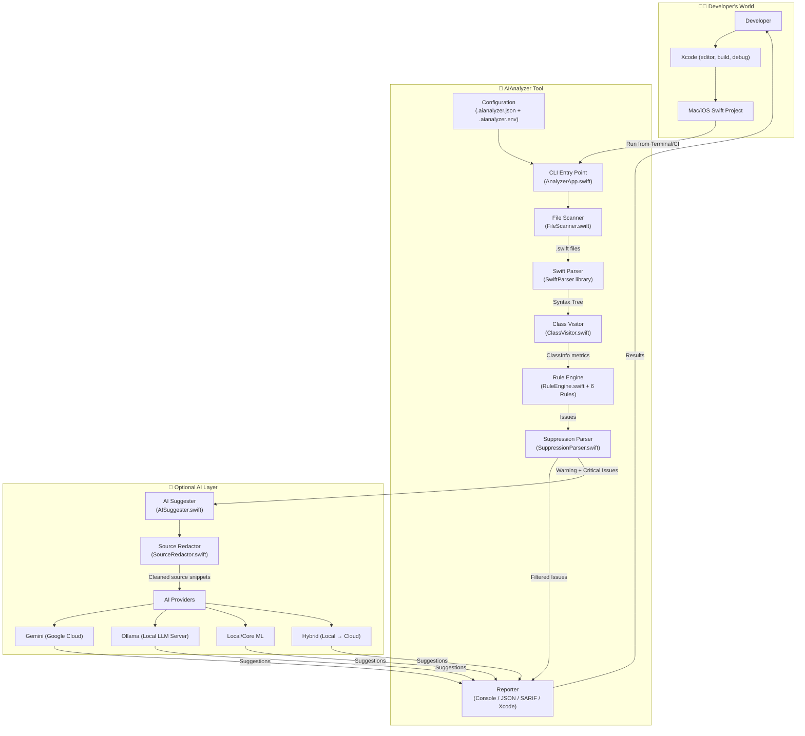
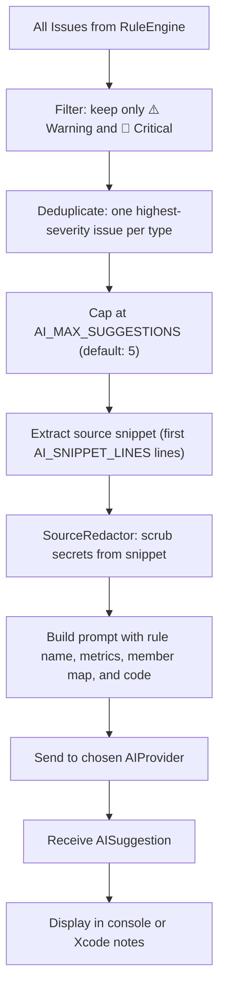

# AIAnalyzer — New Developer Handout

> **Welcome aboard!** This document is your one-stop guide to understanding the AIAnalyzer project from the ground up. It's written assuming you're new to the codebase — no prior knowledge required. By the end, you'll understand what this tool does, how it's built, how every piece talks to every other piece, and how you can start contributing.

---

## 1. What Is AIAnalyzer?

AIAnalyzer is a **Swift command-line tool** that acts as a "code health inspector" for Mac and iOS projects. Think of it like a spell-checker, but for code architecture.

It does two things:

1. **Static Analysis** — It reads your Swift source files, parses the code into a tree structure, and checks for common architectural problems like classes that are too large, objects that do too many things ("God Objects"), or ViewModels that accidentally depend on UIKit.

2. **AI-Powered Suggestions** *(optional)* — When you turn AI on, the tool sends the problematic code (with secrets scrubbed out) to an AI model (Google Gemini, a local Ollama model, or a Core ML model) and gets back refactoring advice.

It's **not** an IDE, a compiler, or a replacement for Xcode. It's a companion tool that you run from Terminal, an Xcode build phase, or a CI pipeline to keep your codebase clean.

---

## 2. Technology Stack

Here's everything the project is built with, and why:

| Technology | What It Is | Why We Use It |
|---|---|---|
| **Swift 5.7+** | Apple's programming language | The entire tool is written in Swift. Since it analyzes Swift code, it makes sense to be written in Swift too. |
| **Swift Package Manager (SPM)** | Swift's built-in dependency and build tool | Manages our only external dependency and builds the executable. No Xcode project file needed. |
| **SwiftSyntax** | Apple's library for parsing Swift source code | Turns raw `.swift` files into a syntax tree we can walk through programmatically. |
| **SwiftParser** | Companion to SwiftSyntax | The actual parser that reads Swift source text and produces the syntax tree. |
| **XCTest** | Apple's testing framework | All our unit tests use this — run with `swift test`. |
| **macOS 13+ / iOS 13+** | Target platforms | The CLI runs on macOS. The `iOS 13+` declaration exists so the package can be imported by iOS projects if needed in the future. |
| **Homebrew** | macOS package manager | How end users install the tool: `brew install elangbamjohnson/tap/aianalyzer`. |
| **GitHub Actions** | CI/CD automation | Runs tests on every push/PR, and builds release binaries when we tag a version. |

### The Only External Dependency

```swift
.package(url: "https://github.com/apple/swift-syntax.git", from: "508.0.0")
```

That's it — one dependency. The project is intentionally lightweight.

---

## 3. High-Level Architecture

Here's the big picture of how everything fits together:



### The Flow in Plain English

1. **You point the tool at a Swift file or folder** → `aianalyzer /path/to/project`
2. **The CLI validates your input** — Is it a real path? Is it a `.swift` file or a directory?
3. **Configuration loads** — First `.aianalyzer.env` (for AI settings), then `.aianalyzer.json` (for rule toggles and thresholds).
4. **File Scanner collects all `.swift` files** — It skips known junk folders like `.build`, `Pods`, `DerivedData`.
5. **SwiftParser parses each file** — The raw text becomes a syntax tree (like a family tree of code elements).
6. **ClassVisitor walks the syntax tree** — It visits every `class`, `struct`, `enum`, `actor`, and `extension`, counting methods, properties, initializers, lines, etc. This produces a `ClassInfo` object for each type.
7. **RuleEngine evaluates each type** — Each `ClassInfo` gets tested against all enabled rules. Issues are generated.
8. **SuppressionParser filters out intentionally suppressed rules** — If a developer put `// aianalyzer:disable LargeClass` in the file, that rule's issues are dropped.
9. **Reporter outputs the results** — Console for humans, JSON for scripts, SARIF for GitHub code scanning, or Xcode-format for the issue navigator.
10. **If AI is enabled**, the `AISuggester` takes the most severe issues, builds a prompt with the code snippet (after redacting secrets), sends it to the chosen AI provider, and appends refactoring suggestions to the output.

---

## 4. Project Folder Structure

Here's every folder in the project and what lives inside it:

```
AIAnalyzer/
├── Sources/AIAnalyzer/           ← All production source code
│   ├── App/                      ← CLI entry point & input validation
│   │   ├── AnalyzerApp.swift     ← @main — the starting point of everything
│   │   └── InputPathValidator.swift
│   │
│   ├── AI/                       ← Everything related to AI suggestions
│   │   ├── AIProvider.swift      ← Protocol that all AI providers implement
│   │   ├── AIConfiguration.swift ← Reads env vars to configure AI
│   │   ├── AIConstants.swift     ← Endpoint URLs, defaults, etc.
│   │   ├── AISuggester.swift     ← Orchestrates AI calls
│   │   ├── AISuggestion.swift    ← Data model for an AI response
│   │   ├── AISuggestionFormatter.swift ← Formats AI output for the console
│   │   ├── GeminiProvider.swift  ← Google Gemini API integration
│   │   ├── OllamaProvider.swift  ← Ollama local LLM integration
│   │   ├── LocalLLMProvider.swift← Core ML + heuristic fallback
│   │   ├── HybridAIProvider.swift← Tries local first, escalates to cloud
│   │   └── SourceRedactor.swift  ← Scrubs secrets from code before sending to AI
│   │
│   ├── Models/                   ← Core data structures
│   │   ├── ClassInfo.swift       ← Type metrics (methods, props, lines, etc.)
│   │   ├── Issue.swift           ← A single detected problem
│   │   ├── IssueReport.swift     ← JSON/SARIF-friendly version of Issue
│   │   ├── Severity.swift        ← enum: info, warning, critical
│   │   ├── AnalysisSummary.swift ← Aggregate counts for the final summary
│   │   └── AnalyzerConfig.swift  ← Shape of .aianalyzer.json
│   │
│   ├── Rules/                    ← Static analysis rules
│   │   ├── Rule.swift            ← Protocol: all rules implement this
│   │   ├── RuleEngine.swift      ← Runs all rules against all types
│   │   ├── RuleConstants.swift   ← Default thresholds
│   │   ├── LargeClassRule.swift  ← Too many methods or lines
│   │   ├── HighMethodDensityRule.swift ← Methods packed into a small type
│   │   ├── GodObjectRule.swift   ← Multiple simultaneous violations
│   │   ├── DataHeavyClassRule.swift ← Too many stored properties
│   │   ├── ViewModelUIKitRule.swift  ← ViewModel importing UIKit
│   │   └── ModelServiceUIKitRule.swift ← Model/Service importing UIKit
│   │
│   ├── Reporting/                ← How results are displayed
│   │   ├── Reporter.swift        ← Protocol: all reporters implement this
│   │   ├── ConsoleReporter.swift ← Pretty terminal output with emojis
│   │   ├── XcodeReporter.swift   ← Xcode issue navigator format
│   │   └── SarifReport.swift     ← SARIF JSON for GitHub code scanning
│   │
│   ├── Visitor/                  ← Syntax tree walking
│   │   └── ClassVisitor.swift    ← Extracts metrics from Swift syntax nodes
│   │
│   ├── Utils/                    ← Helpers
│   │   ├── FileScanner.swift     ← Recursively finds .swift files
│   │   ├── ConfigLoader.swift    ← Loads .aianalyzer.json
│   │   └── SuppressionParser.swift ← Reads // aianalyzer:disable comments
│   │
│   └── Extension/
│       └── AnalyzerConfig+Default.swift ← Default config values
│
├── Tests/AIAnalyzerTests/        ← 17 test files covering every component
│
├── .github/workflows/            ← CI/CD
│   ├── ci.yml                    ← Build + test on push/PR
│   └── release.yml               ← Build release binary + GitHub Release on tag
│
├── Fixtures/                     ← Small sample files for smoke tests
├── TestSandbox/                  ← Sample projects for manual testing
├── docs/                         ← Extra documentation
│   ├── integrations/             ← GitHub Actions + SARIF setup
│   └── distribution/             ← Homebrew publishing guide
├── packaging/homebrew/           ← Homebrew formula template
│
├── Package.swift                 ← SPM manifest (the "build recipe")
├── Package.resolved              ← Pinned dependency versions
├── .aianalyzer.json              ← Project's own analyzer config
├── .aianalyzer.env               ← AI environment settings
├── sample.swift                  ← Quick test file
├── README.md                     ← Full project README
├── TESTING.md                    ← Test-specific guide
├── LICENSE                       ← MIT License
└── .gitignore
```

---

## 5. Core Concepts — The Data Models

Before diving into the pipeline, let's understand the key data types. These are like the "nouns" of the project:

### `ClassInfo` — The Fingerprint of a Type

When the visitor walks through a Swift file, it creates one `ClassInfo` for **every class, struct, enum, actor, and extension** it finds. This is the main unit of analysis.

```swift
struct ClassInfo {
    let type: ClassType      // .viewController, .viewModel, .service, .model, or .unknown
    let name: String         // e.g., "UserViewModel"
    let methodCount: Int     // How many func declarations
    let propertyCount: Int   // How many stored properties
    let initializerCount: Int // How many init() declarations
    let subscriptCount: Int  // How many subscript declarations
    let accessorCount: Int   // How many computed properties (get/set)
    let lineCount: Int       // Approximate lines of code in the type
    let memberInfos: [MemberInfo]  // Name + line range for each member
    let imports: [String]    // Module imports in the same file (e.g., ["UIKit", "Foundation"])
}
```

**Type classification is simple — it's based on naming conventions:**

| If the type name contains... | It's classified as... |
|---|---|
| `viewcontroller` | `.viewController` |
| `viewmodel` | `.viewModel` |
| `service` or `manager` | `.service` |
| `model` | `.model` |
| anything else | `.unknown` |

> [!NOTE]
> This is intentionally name-based. The tool does not do full type resolution, module graph analysis, or inheritance chain inspection. Keep this in mind when adding rules.

### `Issue` — A Detected Problem

When a rule fires, it produces an `Issue`:

```swift
struct Issue: Codable {
    let ruleName: String    // e.g., "LargeClass"
    let message: String     // Human-readable explanation
    let severity: Severity  // .info, .warning, or .critical
    let line: Int?          // Source line (optional)
}
```

### `Severity` — How Bad Is It?

```swift
enum Severity: String, Codable {
    case info     = "ℹ️"    // Suggestion — no action required
    case warning  = "⚠️"    // Should be reviewed
    case critical = "🔴"    // Serious architectural violation
}
```

> [!IMPORTANT]
> Only `warning` and `critical` issues are eligible for AI suggestions. `info` issues are never sent to AI.

---

## 6. The Analysis Pipeline — Step by Step

Let's trace what happens when you run `aianalyzer /path/to/project`:

### Step 1: CLI Argument Parsing

[AnalyzerApp.swift](file:///Users/johnsonelangbam/Projects/AIAnalyzer/Sources/AIAnalyzer/App/AnalyzerApp.swift) is the `@main` entry point. It parses:

- **Positional argument**: the file/folder path (defaults to `sample.swift` if omitted)
- **Output format**: `--format console|json|xcode|sarif` or shortcuts like `--json`, `--xcode`
- **Quality gates**: `--fail-on-critical`, `--fail-on-warning`, `--strict`
- **Help**: `--help` or `-h`

### Step 2: Input Validation

[InputPathValidator.swift](file:///Users/johnsonelangbam/Projects/AIAnalyzer/Sources/AIAnalyzer/App/InputPathValidator.swift) checks that if you gave it a single file, it's actually a `.swift` file.

### Step 3: Load Environment

The `EnvironmentFileLoader` (defined inside [AnalyzerApp.swift](file:///Users/johnsonelangbam/Projects/AIAnalyzer/Sources/AIAnalyzer/App/AnalyzerApp.swift#L573-L694)) walks **upward** from the scan root looking for `.aianalyzer.env`. If multiple are found at different levels, only the **outermost** (closest to filesystem root) is used — this prevents nested configs from conflicting.

The `.env` file sets environment variables like:
```
AI_ENABLED=true
AI_PROVIDER=ollama
OLLAMA_MODEL=qwen2.5-coder:7b
```

### Step 4: Load JSON Config

[ConfigLoader.swift](file:///Users/johnsonelangbam/Projects/AIAnalyzer/Sources/AIAnalyzer/Utils/ConfigLoader.swift) reads `.aianalyzer.json` and merges it with defaults from [AnalyzerConfig+Default.swift](file:///Users/johnsonelangbam/Projects/AIAnalyzer/Sources/AIAnalyzer/Extension/AnalyzerConfig+Default.swift). This controls:

- **Ignored directories** (e.g., `TestSandbox`, `Pods`) — merged with built-in defaults like `.build`, `.git`, `DerivedData`.
- **Rule toggles** — enable/disable each rule independently.
- **Rule thresholds** — customize how many methods = "too many".

### Step 5: File Discovery

[FileScanner.swift](file:///Users/johnsonelangbam/Projects/AIAnalyzer/Sources/AIAnalyzer/Utils/FileScanner.swift) recursively finds all `.swift` files while skipping ignored directories.

### Step 6: Parse → Visit → Analyze (Per File)

For **each** `.swift` file:

```mermaid
flowchart LR
    Source["Raw .swift text"] --> Parse["SwiftParser.parse()"]
    Parse --> Tree["Syntax Tree"]
    Tree --> ImportExtract["Extract file imports"]
    ImportExtract --> Walk["ClassVisitor.walk()"]
    Walk --> Metrics["Array of ClassInfo"]
    Metrics --> Engine["RuleEngine.analyze()"]
    Engine --> Issues["Array of Issue"]
    Issues --> Suppress["SuppressionParser.filter()"]
    Suppress --> Final["Filtered Issues"]
```



**Parsing** ([SwiftParser](https://github.com/apple/swift-syntax)): Converts raw Swift text like `class Foo { func bar() {} }` into a structured syntax tree.

**Visiting** ([ClassVisitor.swift](file:///Users/johnsonelangbam/Projects/AIAnalyzer/Sources/AIAnalyzer/Visitor/ClassVisitor.swift)): This is a `SyntaxVisitor` subclass. When it encounters a `ClassDeclSyntax`, `StructDeclSyntax`, `EnumDeclSyntax`, `ActorDeclSyntax`, or `ExtensionDeclSyntax`, it counts members and builds a `ClassInfo`. It handles all five type kinds through a shared `processType()` method.

**Rule Evaluation** ([RuleEngine.swift](file:///Users/johnsonelangbam/Projects/AIAnalyzer/Sources/AIAnalyzer/Rules/RuleEngine.swift)): Loops every `ClassInfo` through every registered `Rule`. There's an important deduplication behavior: if a `GodObjectRule` fires on a type, the `LargeClass` and `DataHeavyClass` rules are **suppressed** for that same type (since GodObject already signals "this type has multiple problems").

**Suppression** ([SuppressionParser.swift](file:///Users/johnsonelangbam/Projects/AIAnalyzer/Sources/AIAnalyzer/Utils/SuppressionParser.swift)): Scans the source for `// aianalyzer:disable` comments and removes matching issues.

### Step 7: Reporting

The output goes through the [Reporter protocol](file:///Users/johnsonelangbam/Projects/AIAnalyzer/Sources/AIAnalyzer/Reporting/Reporter.swift):

| Format | Reporter | Use Case |
|---|---|---|
| Console (default) | [ConsoleReporter.swift](file:///Users/johnsonelangbam/Projects/AIAnalyzer/Sources/AIAnalyzer/Reporting/ConsoleReporter.swift) | Pretty terminal output with emojis |
| JSON | Direct encoding to `[IssueReport]` | Script/tool consumption |
| SARIF | [SarifReport.swift](file:///Users/johnsonelangbam/Projects/AIAnalyzer/Sources/AIAnalyzer/Reporting/SarifReport.swift) | GitHub code scanning |
| Xcode | [XcodeReporter.swift](file:///Users/johnsonelangbam/Projects/AIAnalyzer/Sources/AIAnalyzer/Reporting/XcodeReporter.swift) | Xcode issue navigator |

> [!IMPORTANT]
> JSON and SARIF modes **disable AI suggestions** and keep stdout strictly machine-readable. File read errors go to stderr.

### Step 8: Exit Code

By default, the tool exits `0` even if issues are found. CI gates change this:

| Flag | Behavior |
|---|---|
| `--fail-on-critical` | Exit `1` if any critical issue exists |
| `--fail-on-warning` | Exit `1` if any warning or critical issue exists |
| `--strict` | Exit `1` if any issue at all exists (including info) |

---

## 7. The Six Analysis Rules

Each rule is a separate Swift struct conforming to the [Rule protocol](file:///Users/johnsonelangbam/Projects/AIAnalyzer/Sources/AIAnalyzer/Rules/Rule.swift):

```swift
protocol Rule {
    var name: String { get }
    func evaluate(_ classInfo: ClassInfo) -> Issue?
}
```

Here's what each rule does:

### 7.1 LargeClassRule

**File**: [LargeClassRule.swift](file:///Users/johnsonelangbam/Projects/AIAnalyzer/Sources/AIAnalyzer/Rules/LargeClassRule.swift)

**What it checks**: Is this type too big in terms of method count or line count?

**Key behavior**: Uses **different thresholds per type category**. A ViewController is expected to be larger than a Model, so it gets a higher limit. If the type exceeds **2x** the threshold, severity escalates from ⚠️ Warning to 🔴 Critical.

### 7.2 HighMethodDensityRule

**File**: [HighMethodDensityRule.swift](file:///Users/johnsonelangbam/Projects/AIAnalyzer/Sources/AIAnalyzer/Rules/HighMethodDensityRule.swift)

**What it checks**: Does this type pack too many methods into too few lines? (methods ÷ lines ratio)

**Why it matters**: A 300-line class with 50 methods means each method is ~6 lines — likely doing too many small things in one place.

### 7.3 GodObjectRule

**File**: [GodObjectRule.swift](file:///Users/johnsonelangbam/Projects/AIAnalyzer/Sources/AIAnalyzer/Rules/GodObjectRule.swift)

**What it checks**: Does this type violate **at least 2 of 3** signals: too many methods, too many properties, too many lines?

**Why it's special**: Always 🔴 Critical. When this fires, `LargeClass` and `DataHeavyClass` are automatically suppressed for the same type to reduce noise.

### 7.4 DataHeavyClassRule

**File**: [DataHeavyClassRule.swift](file:///Users/johnsonelangbam/Projects/AIAnalyzer/Sources/AIAnalyzer/Rules/DataHeavyClassRule.swift)

**What it checks**: Does this type have too many stored properties?

**Severity**: ℹ️ Info — this is advisory, not a hard failure.

### 7.5 ViewModelUIKitRule

**File**: [ViewModelUIKitRule.swift](file:///Users/johnsonelangbam/Projects/AIAnalyzer/Sources/AIAnalyzer/Rules/ViewModelUIKitRule.swift)

**What it checks**: Is a ViewModel-like type importing UIKit? ViewModels should be platform-independent.

**Severity**: 🔴 Critical — this is an architecture violation.

### 7.6 ModelServiceUIKitRule

**File**: [ModelServiceUIKitRule.swift](file:///Users/johnsonelangbam/Projects/AIAnalyzer/Sources/AIAnalyzer/Rules/ModelServiceUIKitRule.swift)

**What it checks**: Is a Model or Service type importing UIKit?

**Severity**: 🔴 Critical.

---

## 8. How The AI Layer Works

The AI layer is **completely optional**. When disabled (`AI_ENABLED=false`), no AI code runs at all. Here's how it works when turned on:

### The AI Pipeline



### How Prompt Construction Works

The [AIRequestContext](file:///Users/johnsonelangbam/Projects/AIAnalyzer/Sources/AIAnalyzer/AI/AIProvider.swift#L16-L98) bundles three things:

1. **The Issue** — which rule fired and why
2. **The ClassInfo** — structural metrics about the type
3. **A source code snippet** — the first N lines of the file (after secret redaction)

It then builds a text prompt like:

```
You are a senior Swift architect.
Analyze this finding and provide concise, actionable refactor guidance.

Rule: LargeClass
Severity: ⚠️
Issue message: Type UserViewModel is too large: 25 methods (limit: 12)
Type: UserViewModel

Structural Profile:
- Methods: 25
- Total Lines: 450
...

Code Snippet:
[the actual source code, with secrets removed]

Return:
1) Root cause (1-2 lines)
2) Refactor steps (3-5 bullets)
3) Quick win (1 bullet)
```

### The Four AI Providers

| Provider | How It Works | When to Use |
|---|---|---|
| **Gemini** ([GeminiProvider.swift](file:///Users/johnsonelangbam/Projects/AIAnalyzer/Sources/AIAnalyzer/AI/GeminiProvider.swift)) | Sends HTTP POST to Google's Gemini API. Has retry logic with exponential backoff for rate limiting (429) and network errors. | When you want the highest quality suggestions and are okay sending code to Google. |
| **Ollama** ([OllamaProvider.swift](file:///Users/johnsonelangbam/Projects/AIAnalyzer/Sources/AIAnalyzer/AI/OllamaProvider.swift)) | Sends requests to a local Ollama server (default: `http://localhost:11434`). Uses the OpenAI-compatible API. | When you want AI but must keep code on your machine. |
| **Local/Core ML** ([LocalLLMProvider.swift](file:///Users/johnsonelangbam/Projects/AIAnalyzer/Sources/AIAnalyzer/AI/LocalLLMProvider.swift)) | Attempts to use a Core ML `.mlmodelc` bundle. Falls back to rule-based heuristic suggestions if no model is available. | Experimental. Mostly produces heuristic fallbacks today. |
| **Hybrid** ([HybridAIProvider.swift](file:///Users/johnsonelangbam/Projects/AIAnalyzer/Sources/AIAnalyzer/AI/HybridAIProvider.swift)) | Tries Ollama first → if low confidence, escalates to Gemini → if that fails, falls back to local heuristics. | Best of both worlds: fast local when possible, cloud when needed. |

### Privacy and Security

> [!CAUTION]
> **Cloud AI is opt-in.** Setting `AI_ENABLED=true` alone does NOT allow cloud requests. You must ALSO set `AI_CLOUD_OPT_IN=true` AND provide `GEMINI_API_KEY`.

Before any code snippet is sent to an AI provider, [SourceRedactor.swift](file:///Users/johnsonelangbam/Projects/AIAnalyzer/Sources/AIAnalyzer/AI/SourceRedactor.swift) removes:

- API keys, tokens, secrets, passwords, client secrets (in common patterns)
- Bearer token values
- Anything matching `apiKey = "..."` or `"secret": "..."` style patterns

### AI Environment Variables Reference

| Variable | What It Does | Default |
|---|---|---|
| `AI_ENABLED` | Master switch — must be `true` for any AI to run | `false` |
| `AI_PROVIDER` | Which provider: `gemini`, `ollama`, `local`, or `hybrid` | `local` |
| `AI_CLOUD_OPT_IN` | Must be `true` to allow Gemini/cloud calls | `false` |
| `GEMINI_API_KEY` | Your Google Gemini API key | *(none)* |
| `AI_MODEL` | Gemini model name | `gemini-1.5-flash` |
| `OLLAMA_MODEL` | Ollama model name | `qwen2.5-coder:7b` |
| `OLLAMA_ENDPOINT` | Ollama server URL | `http://localhost:11434` |
| `AI_LOCAL_MODEL_PATH` | Path to a Core ML `.mlmodelc` bundle | *(none)* |
| `AI_MAX_SUGGESTIONS` | Max AI calls per file | `5` |
| `AI_SNIPPET_LINES` | Lines of source code included in each prompt | `120` |
| `AI_VERBOSE` | Show raw AI output | `false` |
| `AI_TYPEWRITER_MS` | Delay between characters for typewriter effect | `8` |

---

## 9. Configuration

There are **two** config files:

### `.aianalyzer.json` — Rule Settings

Lives in the root of the project being scanned. Example:

```json
{
    "ignoreDirectories": ["TestSandbox", "Generated", "Pods"],
    "rules": {
        "largeClass": { "enabled": true, "threshold": 15 },
        "highMethodDensity": { "enabled": true, "threshold": 8 },
        "godObject": { "enabled": true },
        "dataHeavyClass": { "enabled": true, "threshold": 5 },
        "viewModelUIKit": { "enabled": true },
        "modelServiceUIKit": { "enabled": true }
    }
}
```

### `.aianalyzer.env` — AI Settings

Lives alongside the JSON config. It's a simple `KEY=value` file:

```bash
AI_ENABLED=false
AI_PROVIDER=gemini
GEMINI_API_KEY=your_key_here
AI_MAX_SUGGESTIONS=5
```

> [!WARNING]
> Never commit real API keys. Use environment variables in CI, and keep `.aianalyzer.env` in `.gitignore` if it contains secrets.

### In-Source Suppressions

You can suppress rules per-file using comments:

```swift
// aianalyzer:disable LargeClass           ← suppress one rule
// aianalyzer:disable LargeClass, GodObject ← suppress multiple
// aianalyzer:disable all                   ← suppress everything
```

---

## 10. How To Set Up Your Development Environment

### Prerequisites

- **macOS 13+** (Ventura or later)
- **Xcode 14+** (for the Swift 5.7+ toolchain — you can also use just the command-line tools)
- **Git**

### First-Time Setup

```bash
# Clone the repo
git clone https://github.com/elangbamjohnson/AIAnalyzer.git
cd AIAnalyzer

# Resolve dependencies (downloads SwiftSyntax)
swift package resolve

# Build
swift build

# Run all tests
swift test

# Run the analyzer on the sample file (AI off)
AI_ENABLED=false swift run AIAnalyzer sample.swift

# Run on the test sandbox project
AI_ENABLED=false swift run AIAnalyzer TestSandbox/MessyProject
```

### Working in Xcode

You can open the project in Xcode using SPM:

```bash
open Package.swift
```

Xcode will resolve dependencies automatically. Use the `AIAnalyzer` scheme to build and run.

---

## 11. Testing

The project has **17 test files** covering every component:

| Test File | What It Tests |
|---|---|
| `ClassVisitorTests.swift` | Syntax tree visiting and metric extraction |
| `BasicRuleTests.swift` | LargeClassRule |
| `HighMethodDensityRuleTests.swift` | HighMethodDensityRule |
| `GodObjectRuleTests.swift` | GodObjectRule |
| `ArchitecturalRuleTests.swift` | ViewModelUIKitRule |
| `ModelServiceUIKitRuleTests.swift` | ModelServiceUIKitRule |
| `RuleEngineTests.swift` | Rule deduplication logic |
| `AISuggesterTests.swift` | AI suggestion orchestration |
| `AIConfigurationTests.swift` | Environment variable parsing |
| `AIRequestContextTests.swift` | Prompt building |
| `HybridAIProviderTests.swift` | Hybrid provider fallback logic |
| `SourceRedactorTests.swift` | Secret scrubbing |
| `SuppressionParserTests.swift` | `// aianalyzer:disable` comment parsing |
| `InputPathValidatorTests.swift` | Path validation |
| `XcodeReporterTests.swift` | Xcode output format |
| `SarifReportTests.swift` | SARIF output format |
| `TestAIProviderStubs.swift` | Test doubles for AI providers |

### Running Tests

```bash
# All tests
swift test

# A specific test suite
swift test --filter ModelServiceUIKitRuleTests

# All visitor-related tests
swift test --filter Visitor

# All AI-related tests
swift test --filter AISuggesterTests
```

> [!TIP]
> Always set `AI_ENABLED=false` when running tests to avoid making real AI API calls. The test suite uses stub providers from [TestAIProviderStubs.swift](file:///Users/johnsonelangbam/Projects/AIAnalyzer/Tests/AIAnalyzerTests/TestAIProviderStubs.swift).

---

## 12. CI/CD Pipeline

### Continuous Integration — [ci.yml](file:///Users/johnsonelangbam/Projects/AIAnalyzer/.github/workflows/ci.yml)

Runs on every push to `main` and every pull request:

1. Checks out code
2. Caches SwiftPM dependencies
3. `swift build -v` — compile everything
4. `swift test -v` — run all tests
5. **Smoke test** — runs the analyzer on `Fixtures/SmokeSample.swift` with `--json` and validates the output is valid JSON

### Release Automation — [release.yml](file:///Users/johnsonelangbam/Projects/AIAnalyzer/.github/workflows/release.yml)

Triggered when you push a Git tag matching `v*` (e.g., `v0.1.2`):

1. `swift build -c release` — build an optimized binary
2. Packages the binary into `aianalyzer-macos-arm64.zip`
3. Creates a GitHub Release with the zip attached

After the release, you update the Homebrew formula in the separate `elangbamjohnson/homebrew-tap` repo with the new download URL and SHA-256.

---

## 13. How To Contribute — Common Tasks

### Adding a New Rule

1. Create a new file in [Sources/AIAnalyzer/Rules/](file:///Users/johnsonelangbam/Projects/AIAnalyzer/Sources/AIAnalyzer/Rules) — your struct must conform to [Rule](file:///Users/johnsonelangbam/Projects/AIAnalyzer/Sources/AIAnalyzer/Rules/Rule.swift).
2. Give it a unique `name` property.
3. Implement `evaluate(_ classInfo: ClassInfo) -> Issue?`.
4. Add a config toggle in [AnalyzerConfig.swift](file:///Users/johnsonelangbam/Projects/AIAnalyzer/Sources/AIAnalyzer/Models/AnalyzerConfig.swift) if it should be user-configurable.
5. Set default values in [AnalyzerConfig+Default.swift](file:///Users/johnsonelangbam/Projects/AIAnalyzer/Sources/AIAnalyzer/Extension/AnalyzerConfig+Default.swift).
6. Wire config loading in [ConfigLoader.swift](file:///Users/johnsonelangbam/Projects/AIAnalyzer/Sources/AIAnalyzer/Utils/ConfigLoader.swift).
7. Register the rule in [AnalyzerApp.swift](file:///Users/johnsonelangbam/Projects/AIAnalyzer/Sources/AIAnalyzer/App/AnalyzerApp.swift) (look for the block around lines 97-124).
8. Write tests in [Tests/AIAnalyzerTests/](file:///Users/johnsonelangbam/Projects/AIAnalyzer/Tests/AIAnalyzerTests).
9. Choose severity carefully — only ⚠️ and 🔴 get AI suggestions.

### Adding a New AI Provider

1. Create a new file in [Sources/AIAnalyzer/AI/](file:///Users/johnsonelangbam/Projects/AIAnalyzer/Sources/AIAnalyzer/AI) — conform to [AIProvider](file:///Users/johnsonelangbam/Projects/AIAnalyzer/Sources/AIAnalyzer/AI/AIProvider.swift).
2. Implement `func suggest(for context: AIRequestContext) async throws -> AISuggestion`.
3. Add any needed config to [AIConstants.swift](file:///Users/johnsonelangbam/Projects/AIAnalyzer/Sources/AIAnalyzer/AI/AIConstants.swift) and [AIConfiguration.swift](file:///Users/johnsonelangbam/Projects/AIAnalyzer/Sources/AIAnalyzer/AI/AIConfiguration.swift).
4. Wire provider construction in the `buildAISuggester` method of [AnalyzerApp.swift](file:///Users/johnsonelangbam/Projects/AIAnalyzer/Sources/AIAnalyzer/App/AnalyzerApp.swift#L414-L476).
5. Add tests using stubs from [TestAIProviderStubs.swift](file:///Users/johnsonelangbam/Projects/AIAnalyzer/Tests/AIAnalyzerTests/TestAIProviderStubs.swift).

### Adding a New Output Format

1. Create a formatter/reporter in [Sources/AIAnalyzer/Reporting/](file:///Users/johnsonelangbam/Projects/AIAnalyzer/Sources/AIAnalyzer/Reporting).
2. Add the format to `AnalyzerApp.OutputFormat` enum.
3. Add parsing in `parseCLIArguments()` and `outputFormatValue()`.
4. Add emission in `AnalyzerApp.main()`.

---

## 14. Key Design Decisions to Know

These are choices that shaped the codebase. Understanding them prevents you from fighting the architecture:

1. **One external dependency only** — The project deliberately avoids pulling in argument parsers, networking libraries, or logging frameworks. This keeps builds fast and the tool portable.

2. **Name-based type classification** — Types are categorized by their name (e.g., contains "ViewModel" → classified as ViewModel). This avoids the complexity of full type resolution.

3. **Rules are independent** — Each rule is a standalone struct. The only inter-rule behavior is the GodObject deduplication in `RuleEngine`. Rules don't talk to each other.

4. **AI is an overlay, not a core feature** — The entire static analysis pipeline works perfectly without AI. AI is a post-processing step that enriches results. Machine-readable output (JSON/SARIF) explicitly disables AI.

5. **Privacy-first AI** — Cloud AI requires double opt-in (`AI_ENABLED=true` AND `AI_CLOUD_OPT_IN=true`). Secrets are scrubbed before prompts are constructed.

6. **Env file walks upward** — `.aianalyzer.env` is found by walking up the directory tree. If multiple are found, only the outermost is used. This supports monorepo setups.

---

## 15. Current Limitations

Be aware of these when working on the project:

- **Type classification is name-based** — `MyHelper` won't be classified as a Service even if it acts like one.
- **Import checks are file-level** — If a file imports UIKit, every type in that file sees that import.
- **Line ranges are approximate** — Member line counts use syntax description lengths, not precise source locations.
- **JSON and SARIF skip AI** — Machine-readable output never includes AI suggestions.
- **AI output varies** — Different models/providers give different advice. It's advisory, not deterministic.
- **Apple Silicon only** — The current release binary is `arm64`. Intel Mac support requires building a universal binary.

---

## 16. Quick Reference — Common Commands

```bash
# Build the project
swift build

# Run all tests
swift test

# Run a specific test
swift test --filter GodObjectRuleTests

# Analyze a file (no AI)
AI_ENABLED=false swift run AIAnalyzer sample.swift

# Analyze a project folder (no AI)
AI_ENABLED=false swift run AIAnalyzer /path/to/YourProject

# Analyze with JSON output
AI_ENABLED=false swift run AIAnalyzer /path/to/YourProject --format json

# Analyze with SARIF output (for GitHub)
AI_ENABLED=false swift run AIAnalyzer /path/to/YourProject --format sarif > results.sarif

# Analyze with Xcode output
AI_ENABLED=false swift run AIAnalyzer /path/to/YourProject --format xcode

# Analyze with AI (Gemini)
AI_ENABLED=true AI_PROVIDER=gemini AI_CLOUD_OPT_IN=true GEMINI_API_KEY=your_key swift run AIAnalyzer /path/to/YourProject

# Analyze with AI (local Ollama)
AI_ENABLED=true AI_PROVIDER=ollama OLLAMA_MODEL=qwen2.5-coder:7b swift run AIAnalyzer /path/to/YourProject

# Install via Homebrew (end users)
brew install elangbamjohnson/tap/aianalyzer

# Show help
swift run AIAnalyzer --help
```

---

## 17. Where to Go Next

| Want to... | Start here |
|---|---|
| Understand the full README | [README.md](file:///Users/johnsonelangbam/Projects/AIAnalyzer/README.md) |
| Run and debug tests | [TESTING.md](file:///Users/johnsonelangbam/Projects/AIAnalyzer/TESTING.md) |
| Set up GitHub Actions + SARIF | `docs/integrations/` |
| Publish a Homebrew release | `docs/distribution/` |
| See the project roadmap | `Project Roadmap.rtf` |
| Look at a sample Swift file | [sample.swift](file:///Users/johnsonelangbam/Projects/AIAnalyzer/sample.swift) |
| See test sandbox projects | [TestSandbox/](file:///Users/johnsonelangbam/Projects/AIAnalyzer/TestSandbox) |

---

> **License**: MIT — see [LICENSE](file:///Users/johnsonelangbam/Projects/AIAnalyzer/LICENSE)
>
> **Project Owner**: Johnson Elangbam
